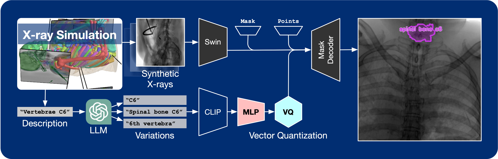

<h1 align="center">
FluoroSAM
  <br>
<a href="https://arxiv.org/abs/2403.08059"></a>
  <a href="https://github.com/arcadelab/fluorosam"></a>
  <a href="https://github.com/arcadelab/fluoroseg"></a>
  <a href="https://huggingface.co/datasets/benjamindkilleen/fluoroseg"></a>
  <br>
  
  <br>
</h1>

Language promptable X-ray image segmentation would enable greater flexibility for human-in-the-loop workflows in diagnostic and interventional precision medicine. Prior efforts have contributed task-specific models capable of solving problems within a narrow scope, but expanding to broader use requires additional data, annotations, and training time. Recently, language-aligned foundation models (LFMs) -- machine learning models trained on large amounts of highly variable image and text data thus enabling broad applicability -- have emerged as promising tools for automated image analysis. Existing foundation models for medical image analysis focus on scenarios and modalities where large, richly annotated datasets are available. However, the X-ray imaging modality features highly variable image appearance and applications, from diagnostic chest X-rays to interventional fluoroscopy, with varying availability of data. To pave the way toward an LFM for comprehensive and language-aligned analysis of arbitrary medical X-ray images, we introduce FluoroSAM, a language-promptable variant of the Segment-Anything Model, trained from scratch on 3M synthetic X-ray images from a wide variety of human anatomies, imaging geometries, and viewing angles. These include pseudo-ground truth masks for 128 organ types and 464 tools with associated text descriptions. FluoroSAM is capable of segmenting myriad anatomical structures and tools based on natural language prompts, thanks to the novel incorporation of vector quantization (VQ) of text embeddings in the training process. We hope that FluoroSAM will serve as a useful tool for the community, supporting a variety of applications including diagnostic image analysis, image-guided interventions, and educational purposes.

<div align="center">
  
</div>

This repository includes both a **user-friendly GUI** and **command-line interface**, allowing users to explore and test FluoroSAM’s capabilities with ease. 🚀

---

## Installation

### 1. Clone the repository

```bash
git clone https://github.com/arcadelab/fluorosam.git
cd fluorosam
```

### 2. Create a new conda/mamba environment

```bash
conda create -n fluorosam python==3.11
conda activate fluorosam
pip install -e .
```

### 3. Install the dependencies

```bash
pip install -r requirements.txt
```

### 4. Download the model weights

Download the model weights [here](https://drive.google.com/file/d/1lJqVIuVFbdc9Bcmj17ac_cha-gW827Q6/view?usp=sharing). (2.5GB)

## Usage

### Python Script

Run

```bash
segment --ckpt-path <path_to_model_weights> -i <path_to_input_image> -o <path_to_output_folder>
```

if your weights are not saved locally, you can also indicate the url link.

```bash
segment --ckpt-url <url_to_model_weights> -i <path_to_input_image> -o <path_to_outut_folder>
```

## GUI

<div align="center">
  
</div>

Run

```bash
gui --ckpt-path <path_to_model_weights>
```

## Citation

If you use FluoroSAM in your research, please consider citing our paper:

```bibtex
@inproceedings{killeen2025fluorosam,
  author       = {Killeen, Benjamin D. and Wang, Liam J. and Inigo, Blanca and Zhang, Han and Mehran, Armand and Taylor, Russell H. and Osgood, Greg and Unberath, Mathias},
  title        = {{FluoroSAM: A Language-promptable Foundation Model for Flexible X-ray Image Segmentation}},
  date         = {2025},
  booktitle    = {Proc. Medical Image Computing and Computer Assisted Intervention (MICCAI)},
  publisher    = {Springer},
}
```

## Acknowledgments

This work was supported by the Link Foundation Fellowship for Modeling, Training, and Simulation; the NIH under Grant No. R01EB036341, the NSF under Award No. 2239077, and Johns Hopkins University Internal Funds.

## Coming Soon

- HuggingFace dataset card
- HuggingFace model card for FluoroSAM
